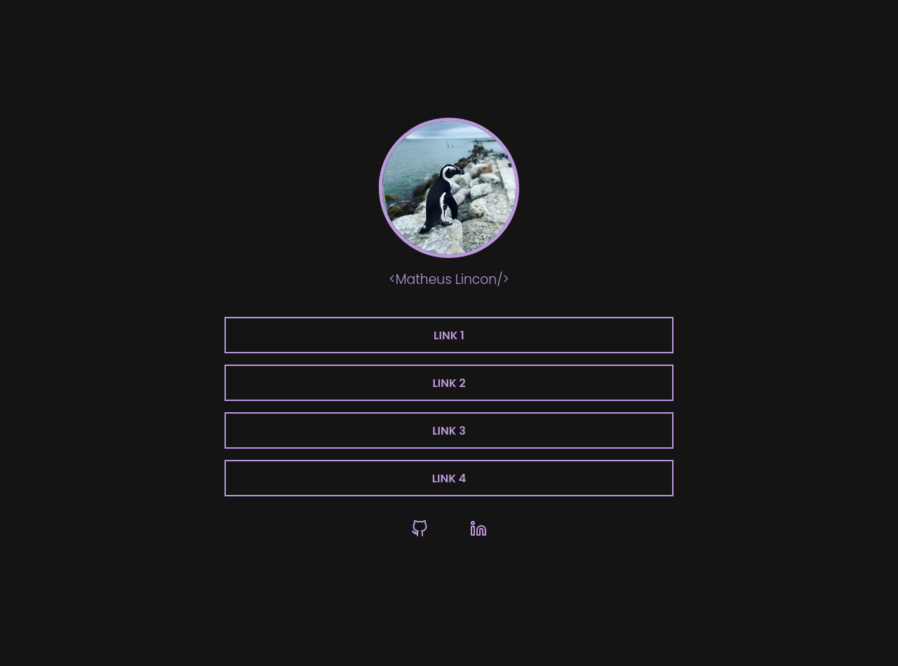
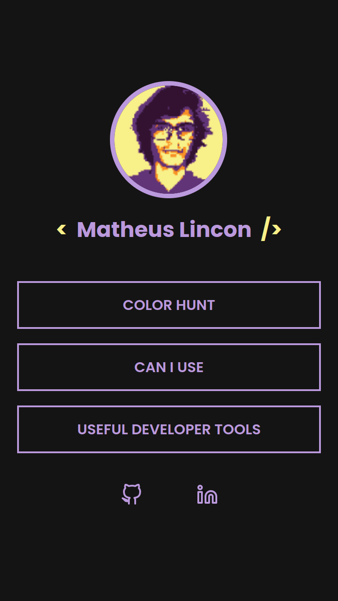

# Desafio Social Tree :paperclips:

## Sobre o projeto :information_source:

Esse projeto feito com HTML & CSS foi tirado de um dos desafiso do Discover, da plataforma [Rocketseat](https://app.rocketseat.com.br/discover).

Um projeto para ser utilizado como uma lista de links úteis que pode ser usado em perfis de redes sociais, parecido com o **Linktree**.

Para mais detalhes sobre o projeto você pode conferir clicando [AQUI](https://app.rocketseat.com.br/discover/challenges/social-tree).

---

## Tecnologias :wrench:

As tecnologias usadas foram:

- HTML
- CSS

---

## Preview :computer:

### Desktop

### Mobile

